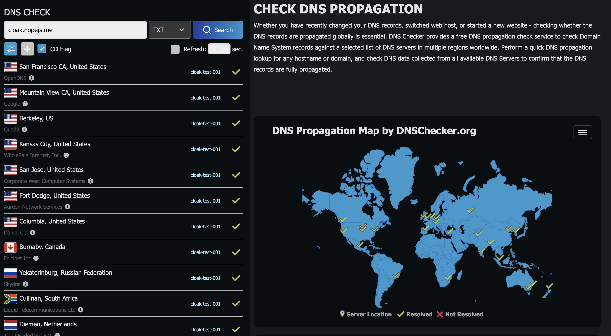

# PoC



## Testing

```
CREATE TABLE artifacts (
    id TEXT PRIMARY KEY,
    type TEXT,
    name TEXT,
    subject TEXT,
    value TEXT,
    published_at TEXT,
    metadata TEXT
);
```
```
sqlite3 cloak.db <<'SQL'
INSERT INTO artifacts(id, type, name, subject, value, published_at, metadata)
VALUES(
  '11111111-1111-1111-1111-111111111111',
  'dns',
  'cloak.nopejs.me',
  'cloak.nopejs.me',
  'cloak-test-001',
  '2025-10-07T10:00:00Z',
  '{"created_via":"cloudflare","record_type":"TXT","ttl":120}'
);
SQL
```


```
CREATE TABLE detections (
  id TEXT PRIMARY KEY,
  artifact_id TEXT,
  provider TEXT,
  detected_at TEXT,
  raw_response TEXT
);
```

```
INSERT INTO detections(id, artifact_id, provider, detected_at, raw_response)
VALUES(
  'det-0001',
  '11111111-1111-1111-1111-111111111111',
  'github_search',
  '2025-10-07T15:30:00Z',
  '{"url":"https://github.com/nope-js/clocktest/blob/main/notes.txt"}'
);
```